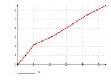
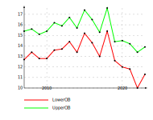

# Chart Generator

This small application generates SVG charts based on data provided in CSV files.

# Usage

```bash
./charts -h
Usage: charts --input INPUT --x X --y Y [--output OUTPUT]

Options:
  --input INPUT, -i INPUT
                         Path to a CSV file containing data
  --x X, -x X            Name of the CSV column containing X axis data
  --y Y, -y Y            Name of the CSV column containing Y axis data
  --output OUTPUT, -o OUTPUT
                         Path to the output CSV file [default: out.svg]
  --help, -h             display this help and exit
```

# Examples

```bash
./charts -i curve.csv -x X -y Y -o curve.svg
```



```bash
# filter data file
cat cp-national-datafile-csv.csv | grep A_Proportion | grep MEASA  > filtered.csv
./charts -i filtered.csv -x Year -y LowerCIB UpperCIB -o cp.svg
```
